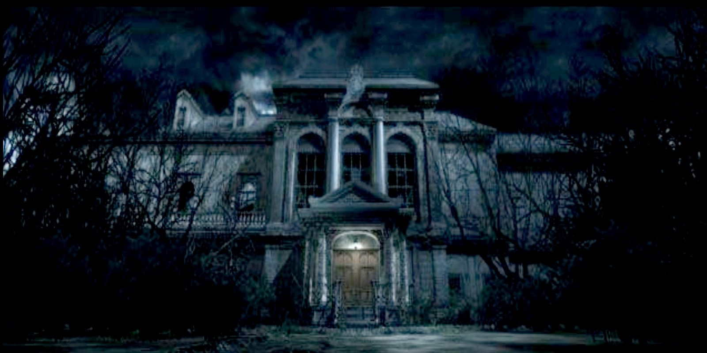

# JavaHouse
JavaScript projects, simple code
<!DOCTYPE html>
<html>
<head>
<link rel="stylesheet" href="style.css">s”>
<body bgcolor="black">
<h2>Casa con JavaScript</h2>
</head>
<body>

<embed src="zombie.mp3" autoplay="null" loop="false" width="200" height="70""></embed>
<button onclick="document.getElementById('myImage').src='abrirpuerta.jpg'">Entrar a la casa</button>
<button onclick="document.getElementById('myImage').src='cerrarpuerta.jpg'">CerrarPuerta</button>
<button onclick="document.getElementById('myImage').src='salir.jpg'">Salir</button>
<button onclick="document.getElementById('myImage').src='bombillon.jpg'">Bombillo On</button>
<button onclick="document.getElementById('myImage').src='bombillof.jpg'">Bombillo Off</button>

Caracteristicas

Area

</body>
</html>
